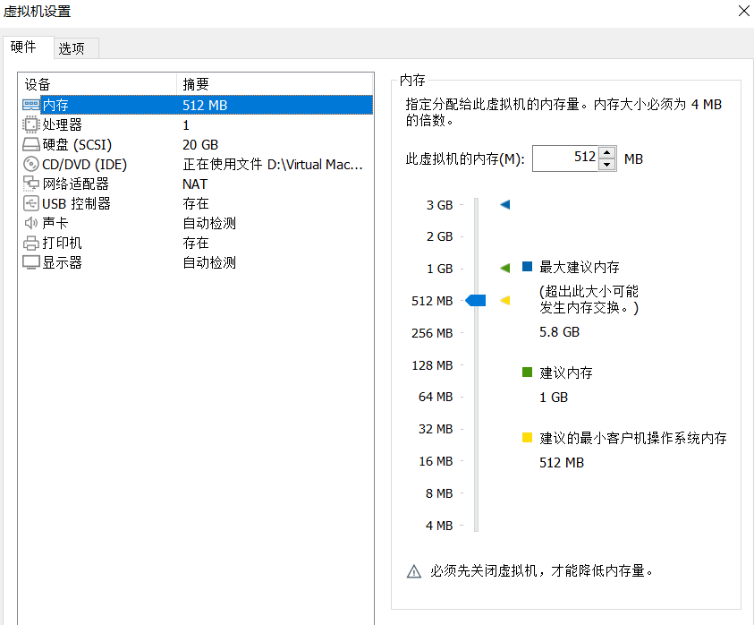
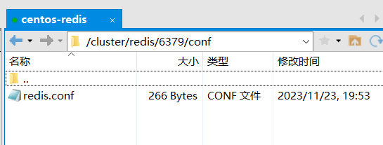

# Chirp

模仿Twitter的社交平台，使用spring cloud开发<br>
前端:[https://github.com/relzx766/Chirp-app](https://github.com/relzx766/Chirp-app)

### 系统环境

jdk 21<br>
nacos 2.2.3 <br>
nginx 1.24.0 <br>
kafka 3.5.0 <br>
mysql 8.0.12<br>
centos 7<br>
docker 24.0.7
docker-compose 1.27.4
### windows部署

kafka:<br>
进入安装根目录\windows\bin<br>
cmd执行:

```shell
.\zookeeper-server-start.bat ..\..\config\zookeeper.properties
```

之后

```shell
.\kafka-server-start.bat ..\..\config\server.properties
```

nacos:<br>
进入安装根目录\bin<br>
cmd执行:

```shell
.\startup.cmd -m standalone
```

nginx:<br>
先在http模块下，修改请求最大体积

```
client_max_body_size 20m;
```

是否设置反向代理就随便了,主要还是用来处理静态资源,在server模块下

```
   location ^~/chirp/ {
           proxy_pass http://127.0.0.1:8080/; # 加上斜杠，去掉/chirp前缀
           proxy_set_header Host $proxy_host; # 修改转发请求头，让8080端口的应用可以受到真实的请求
           proxy_set_header X-Real-IP $remote_addr;
           proxy_set_header X-Forwarded-For $proxy_add_x_forwarded_for;
           proxy_set_header X-Forwarded-Proto $scheme; # 设置转发协议
       }
```

<br>
进入安装根目录<br>
cmd执行:

```shell
nginx
```

centos7：
安装时必须保证有1g内存，安装完后可调为512m<br>
配置如下<br>

安装完成后进入/etc/sysconfig/network-scripts
修改网卡配置文件ifcfg-ens33，如下

```properties
TYPE="Ethernet"
PROXY_METHOD="none"
BROWSER_ONLY="no"
BOOTPROTO="static"
DEFROUTE="yes"
IPV4_FAILURE_FATAL="no"
IPV6INIT="yes"
IPV6_AUTOCONF="yes"
IPV6_DEFROUTE="yes"
IPV6_FAILURE_FATAL="no"
IPV6_ADDR_GEN_MODE="stable-privacy"
NAME="ens33"
UUID="f29bf30c-05fb-4f66-ba18-e1df504c6ddb"
DEVICE="ens33"
ONBOOT="yes"
IPADDR=192.168.233.111
GATEWAY=192.168.233.2
DNS1=192.168.233.2
```

gateway、dns1只要与ip不同就行，ip取决你的VMware网络设置
在docker中部署redis集群<br>
在根目录创建cluster文件夹，创建docker-compose.yml文件，文件内容如下

```yaml
version: "3.6"
services:
  redis-node-1:
    image: redislabs/rebloom # 基础镜像
    container_name: redis-node-1 # 容器服务名
    environment: # 环境变量
      - PORT=6379 # 跟conf 里的配置一样的端口
    ports: # 映射端口，对外提供服务
      - "6379:6379" # redis 的服务端口
      - "16379:16379" # redis 集群监控端口
    networks: # docker 网络设置
      - default
    privileged: true # 拥有容器内命令执行的权限
    command: [ "redis-server", "/etc/redis/redis.conf", "--loadmodule", "/usr/lib/redis/modules/redisbloom.so" ]
    volumes:
      - /cluster/redis/6379/conf:/etc/redis/
      - /cluster/redis/6379/data:/data

  redis-node-2:
    image: redislabs/rebloom
    container_name: redis-node-2
    environment:
      - PORT=6380
    networks:
      - default
    ports:
      - "6380:6380"
      - "16380:16380"
    privileged: true
    command: [ "redis-server", "/etc/redis/redis.conf", "--loadmodule", "/usr/lib/redis/modules/redisbloom.so" ]
    volumes:
      - /cluster/redis/6380/conf:/etc/redis/
      - /cluster/redis/6380/data:/data

  redis-node-3:
    image: redislabs/rebloom
    container_name: redis-node-3
    environment:
      - PORT=6381
    networks:
      - default
    ports:
      - "6381:6381"
      - "16381:16381"
    privileged: true
    command: [ "redis-server", "/etc/redis/redis.conf", "--loadmodule", "/usr/lib/redis/modules/redisbloom.so" ]
    volumes:
      - /cluster/redis/6381/conf:/etc/redis/
      - /cluster/redis/6381/data:/data

  redis-node-4:
    image: redislabs/rebloom
    container_name: redis-node-4
    environment:
      - PORT=6382
    networks:
      - default
    ports:
      - "6382:6382"
      - "16382:16382"
    privileged: true
    command: [ "redis-server", "/etc/redis/redis.conf", "--loadmodule", "/usr/lib/redis/modules/redisbloom.so" ]
    volumes:
      - /cluster/redis/6382/conf:/etc/redis/
      - /cluster/redis/6382/data:/data

  redis-node-5:
    image: redislabs/rebloom
    container_name: redis-node-5
    environment:
      - PORT=6383
    ports:
      - "6383:6383"
      - "16383:16383"
    networks:
      - default
    privileged: true
    command: [ "redis-server", "/etc/redis/redis.conf", "--loadmodule", "/usr/lib/redis/modules/redisbloom.so" ]
    volumes:
      - /cluster/redis/6383/conf:/etc/redis/
      - /cluster/redis/6383/data:/data

  redis-node-6:
    image: redislabs/rebloom
    container_name: redis-node-6
    environment:
      - PORT=6384
    ports:
      - "6384:6384"
      - "16384:16384"
    networks:
      - default
    privileged: true
    command: [ "redis-server", "/etc/redis/redis.conf", "--loadmodule", "/usr/lib/redis/modules/redisbloom.so" ]
    volumes:
      - /cluster/redis/6384/conf:/etc/redis/
      - /cluster/redis/6384/data:/data

networks:
  default:
    external:
      name: redis-cluster
```

在每个节点的conf目录下创建redis.conf文件，内容如下

```properties
port 6384
requirepass 1234
masterauth 1234
protected-mode no
daemonize no
appendonly yes
cluster-enabled yes
cluster-config-file node-6384.conf
cluster-node-timeout 15000
cluster-announce-ip 192.168.233.111
cluster-announce-port 6384
cluster-announce-bus-port 16384

```

运行命令

```shell
docker network create redis-cluster
```

cd到/cluster/redis，运行命令

```shell
docker-compose up -d
```

目录结构如下<br>


完成<br>